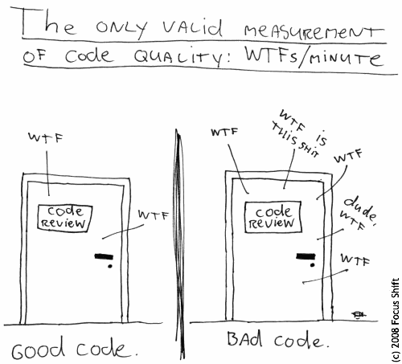
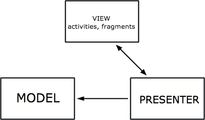

<p align="center">

</p>

*Image from Thom Holwerda. License Attribution-NoDerivs 2.0 Generic (CC BY-ND 2.0). 
[Image Link url](https://www.flickr.com/photos/smitty/2245445147)*

# MVP + DAGGER 2 + RXJAVA (SIMPLE EXAMPLE)

The purpose of this repository is to create an straightforward introduction of the MVP pattern in Android development.

In addition to MVP clean architecture, dependency injection framework (Dagger 2) and Reactive Programming (RxJava) will be sampled within this simple app.

## APP DEMO
<p align="center">

</p>

## MVP
MVP is a clean architecture design pattern that stands for Model-View-Presenter. The main benefits are that it allows you to decouple logic from Activities/Fragments and make the app more testable, easier to maintain, more readable, etc. These are the main components:

<br>

<p align="center">

</p>

#### Model
Will hold the data of our app. The presenter will be responsible for model retrieval/update.

#### View
Just a contract that will be implemented by our activities/fragments. 

+ The implementations of the view contract (usually by the Activitites/Fragments) should NOT have any logic and should be as 'dumb' as possible.

+ These contract methods will be called by the presenter. 

+ The view will be injected into the presenter.

+ For injecting the view into the presenter, we can use Dependency injection framework (Dagger 2)


<b>NOTE: Dagger 2 is not necessary for MVP implementation. You can inject the View contract definition via the presenter's constructor</b>

Code sample:

```java
// View Interface
public interface EntryPointView {
   void displayMessage(final String message); 
}
```


```java
// Activity/Fragment implementing the view interface
public class EntryPointActivity extends AppCompatActivity implements EntryPointView{
	
	
   //Activity instance fields
	
    @Override
    public void displayMessage(String message) {
        Toast.makeText(this, message, Toast.LENGTH_SHORT).show();
    }
}

```

#### Presenter
The presenter will handle all the logic of the app. It will be responsible for updating the model and calling the methods on the view when necessary.
Steps:

+ The view must be passed into the presenter (e.g. setView(View view) method)

+ The activity/fragment that is implementing the view will inject the presenter and will notify the presenter of Android events such as: onResume,onStop,onClick, etc.

+ Then according to these interactions, the presenter will handle when to call the proper methods on the view interface.

Code sample:

```java
public interface EntryPointPresenter {
   void initialize();
   void setView(EntryPointView view);
}
```


```java
public class EntryPointPresenterImplementation implements EntryPointPresenter {
   private EntryPointView view;
   
    @Override
    public void setView(EntryPointView view) {
        this.view = view;
    }

    @Override
    public void initialize() {
        view.displayMessage("Presenter initialized");
        // More initialization logic here
    }
}
```


```java
public class EntryPointActivity extends AppCompatActivity implements EntryPointView{

    @Inject EntryPointPresenterImplementation presenter;
   
    //Activity instance fields
    
    @Override
    public void onResume() {
        super.onResume();
        presenter.setView(this);
        presenter.initialize();
    }
}
```

## DAGGER 2
It's a dependency injection framework, you can find more info [here](https://github.com/google/dagger)

#### Dependency Inversion

Dependency inversion (part of SOLID PRINCIPLES) is a pattern that implements inversion of control for resolving dependencies:

* Dependency: Object that can be used
* Injection: Passing of a dependency to a dependant object that will use it.

More about dependency inversion:

* High level modules should not depend on low level modules. Both should depend on abstractions
* Abstraction should not depend on details. Details should depend on abstractions.

Benefits of dependency injection:

* Makes unit testing easier
* Dependency is at Runtime and not at Compile time


*"A class should configure its dependencies from the outside"*

*"Tighly coupling makes more difficult to modify and to maintain code"*

*"You should program towards an interface vs a concrete implementation"*


#### Dagger 2 Setup

1) Open build.gradle from project and add classpath dependencies (com.neenbedankt.gradle.plugins:android-apt:1.8)

```groovy
buildscript {
    repositories {
        jcenter()
    }
    dependencies {
        classpath 'com.android.tools.build:gradle:2.2.0'
        
        // HERE: ADD THIS LINE BELOW
        classpath 'com.neenbedankt.gradle.plugins:android-apt:1.8'
    }
}

```

2) Add dependencies to the build.gradle at module app.

```groovy
// TOP of the file
apply plugin: 'com.android.application'

// HERE: ADD THIS LINE BELOW
apply plugin: 'com.neenbedankt.android-apt'

// Add this at the BOTTOM of the file
apt 'com.google.dagger:dagger-compiler:2.2'
compile 'com.google.dagger:dagger:2.2'
provided 'javax.annotation:jsr250-api:1.0'
```

3) Create classes/interfaces for Dagger to work:

* <b>Module Classes (e.g. AplicationModule, EntryPointModule)</b>: This is where Dagger will keep track of all dependencies
	* Uses @Module anotation
	* Add modules later on
	* For the methods, you'll need to add:
		* @Provides
		* @Singleton -> Tells Dagger compiler that the instance should be created only once. (Tells )
		

```java	
import android.app.Application;
import android.content.Context;

import javax.inject.Singleton;

import dagger.Module;
import dagger.Provides;

@Module
public class ApplicationModule {
    private Application application;

    public ApplicationModule(Application application){
        this.application = application;
    }

    @Provides
    @Singleton
    public Context provideContext(){
        return application;
    }
}
```

```java
import dagger.Module;
import dagger.Provides;
import franjam.mvpdemo.mvp.presenter.EntryPointPresenterImplementation;

@Module
public class EntryPointModule {

    @Provides
    public EntryPointPresenterImplementation provideMainEntryPresenter(){
        return new EntryPointPresenterImplementation();
    }

    // Here to provide more modules (e.g. presenters, services, etc) to be injected
}

```	
	
* <b>ApplicationComponent</b>: This is used by Dagger to know where to inject the dependencies
	* In Dagger 2 the injector class is called <b>component</b>
	* This component assigns references in our activities, services, fragments,etc.
	* You'll need to specify the component via:
		* @Singleton
		* @Component(modules = ApplicationModule.class)
		* All classes should be added with the inject method

```java
import javax.inject.Singleton;

import dagger.Component;
import franjam.mvpdemo.activities.EntryPointActivity;

@Singleton
@Component(modules = {ApplicationModule.class, EntryPointModule.class})
public interface ApplicationComponent {
    // This is where the presenter will be injected
    void inject(EntryPointActivity target);
}
```

* <b>App</b>: App class will extends from Application and it's where dagger will live on the entire lifetime of the app.
	* Extends from Application
	* onCreate must be override to define component
	* Add method getApplicicationComponent
	* <b>"WARNING: You will have to click on "make run" to generate the dagger component for the first time"</b>
	
```java
import android.app.Application;

public class App extends Application {

    private ApplicationComponent component;

    @Override
    public void onCreate(){
        super.onCreate();

        // NOTE: DaggerApplicationComponent will be generated automatically after 'make project'

        component = DaggerApplicationComponent.builder()
                .applicationModule(new ApplicationModule(this))
                .entryPointModule(new EntryPointModule())
                .build();

    }

    public ApplicationComponent getComponent(){
        return component;
    }
}

```
	
4) Define injection on your desired class:

```java
public class EntryPointActivity extends AppCompatActivity implements EntryPointView, GiphyAdapter.GiphyListener {
    @Inject
    EntryPointPresenterImplementation presenter;
    private RecyclerView recyclerView;

    @Override
    protected void onCreate(Bundle savedInstanceState) {
        super.onCreate(savedInstanceState);
        setContentView(R.layout.main_entry_point_activity);
		
		// Here add your component
		(App)getApplication).getComponent(this)
    }
}
```


## RxJava

#### Concepts

Rx stands for Reactive Extensions (Is a port of the Reactive Extensions library from .NET).
Is a library for composing asynchronous and event-based programs by using observable sequences


With reactive programming, we receive a continuous flow of data (a stream) and we provide the operations to apply to the stream.

#### Main benefits of RxJava in Android

* Simplifies the ability to chain asynchronous operations
* Exposes a more explicit way for declaring how concurrent operations should operate
* Surfaces errors sooner
* Helps reduce the need for state variables that can introduce bugs


#### Main Building Blocks

The basic building blocks of reactive code are Observables and Subscribers:

* Observable: Emits items.
* Subscriber: Consumes those Items.

There is a pattern on how items are emitted. An observable may emit any number of items (including zero items) then is terminated either by successfully completing, or due to an error

For each Subscriber it has, an Observable calls Subscriber.onNext() any number of times, followed by either Subscriber.onCompleted() or Subscriber.onError()

*"It looks A LOT like the standard observer pattern but it differs in one key way - Observables often don’t start emitting items until someone explicitly subscribes to them"*

#### Implementation

* Observable : 
	* Emits items.
	* It may emit any number of items including zero items then it terminates either by successfully completing or by an error.
	* It can have any number of observers attached to it.
	* When an item is emitted the observable calls onNext method on each Observer (Subscriber) which is attached to it.

* Observers (Subscribers) : Consume those items. 

#### Example Setup

1) Add dependencies into build.gradle app:

```groovy
// RxJava
compile 'com.squareup.retrofit2:adapter-rxjava:2.1.0'
compile 'com.squareup.retrofit2:converter-gson:2.1.0'
compile 'com.squareup.retrofit2:converter-scalars:2.1.0'
compile 'io.reactivex:rxandroid:1.2.1'
compile 'io.reactivex:rxjava:1.1.6' 
```
2) Make sure your retrofit contract return an Observable

```java
import franjam.mvpdemo.mvp.model.GiphyData;
import retrofit2.http.GET;
import retrofit2.http.Query;
import rx.Observable;

public interface GiphyContract {
    String PUBLIC_BETA_KEY = "dc6zaTOxFJmzC";
    String targetUrl = "v1/gifs/search?api_key=" + PUBLIC_BETA_KEY;

    @GET(targetUrl)
    Observable<GiphyData> getGiphy(@Query("q")String query);
}
```

3) On your custom Request return a Rx Subscription:

```java
import retrofit2.Retrofit;
import retrofit2.adapter.rxjava.RxJavaCallAdapterFactory;
import retrofit2.converter.gson.GsonConverterFactory;
import retrofit2.converter.scalars.ScalarsConverterFactory;
import rx.Observable;
import rx.Subscriber;
import rx.Subscription;
import rx.android.schedulers.AndroidSchedulers;
import rx.functions.Func1;
import rx.schedulers.Schedulers;

public class GiphyRequest {
    private static final String BASE_URL = "http://api.giphy.com";
    private final GiphyContract contract;
    private final PicsCallback picsCallback;

    public GiphyRequest(PicsCallback picsCallback) {
        Retrofit retrofit = new Retrofit.Builder()
                .baseUrl(BASE_URL)
                .addConverterFactory(GsonConverterFactory.create())
                .addConverterFactory(ScalarsConverterFactory.create())
                .addCallAdapterFactory(RxJavaCallAdapterFactory.create())
                .build();

        this.contract = retrofit.create(GiphyContract.class);
        this.picsCallback = picsCallback;
    }
	
	// Check subscription here
    public Subscription getPics(final String queryText) {

        return contract.getGiphy(queryText)
                .subscribeOn(Schedulers.io())
                .observeOn(AndroidSchedulers.mainThread())
                .onErrorResumeNext(new Func1<Throwable, Observable<? extends GiphyData>>() {
                    @Override
                    public Observable<? extends GiphyData> call(Throwable throwable) {
                        return Observable.error(throwable);
                    }
                })
                .subscribe(new Subscriber<GiphyData>() {
                    @Override
                    public void onCompleted() {
                        picsCallback.onFinished();
                    }

                    @Override
                    public void onError(Throwable e) {
                        picsCallback.onError(e);
                    }

                    @Override
                    public void onNext(GiphyData flickrData) {
                        picsCallback.onSuccess(flickrData);
                    }
                });
    }

    public interface PicsCallback {
        void onSuccess(GiphyData flickrData);
        void onError(Throwable networkError);
        void onFinished();
    }
}
```

4) On your presenter:

* Define an CompositeSubscription instance class field (
import rx.subscriptions.CompositeSubscription;);

* Add your Rx service to the compositeRxSubscription.add when presenter is initialized

* When presenter is no longer available call compositeRxSubscription.unsubscribe();


```java
import rx.Subscription;
import rx.subscriptions.CompositeSubscription;

public class EntryPointPresenterImplementation implements EntryPointPresenter {
  	....
    private CompositeSubscription compositeRxSubscription;

    ...
    @Override
    public void initialize() {
        ...
        
        GiphyCallback giphyCallback = new GiphyCallback(this);
        GiphyRequest request = new GiphyRequest(giphyCallback);

        this.compositeRxSubscription = new CompositeSubscription();
        Subscription rxSubscription = request.getPics(QUERY_TEXT);
        compositeRxSubscription.add(rxSubscription);
    }

    @Override
    public void onStop() {
        compositeRxSubscription.unsubscribe();
    }
}

```

